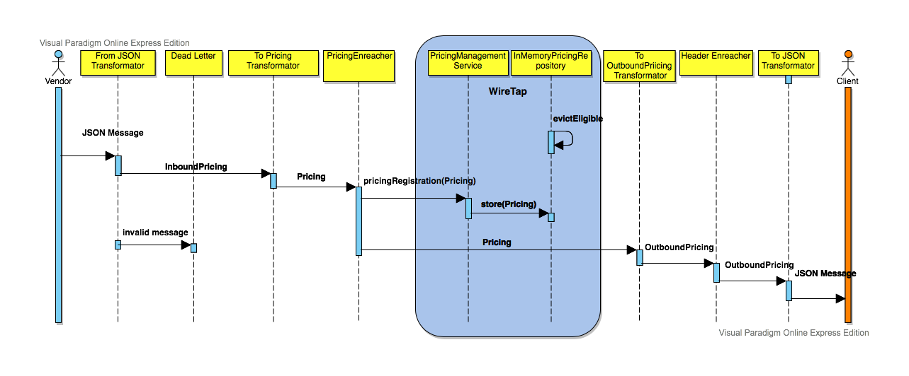
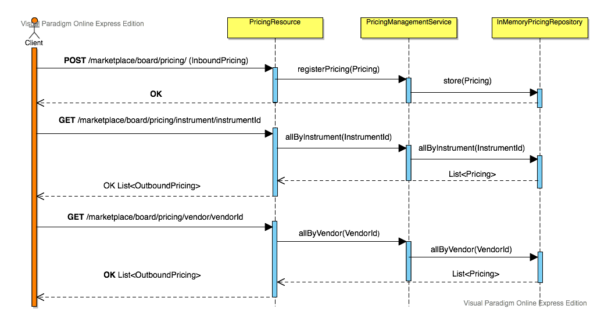

#### Overview

There are two sample vendors VendorX and VendorY that the application is designed to consume pricing data from. The vendors publish messages to two
dedicated inbound queues but for the sake of simplicity it is expected that they publish in the same Json format.

Once transformed into a unified internal data structure a pricing gets stored in the local cache. After this point a pricing is transformed into an
outbound Json format and published to a single outbound Jms topic along with two message headers - 'vendor' and 'instrument'. This way interested
downstream systems/clients can subscribe for required pricing data using an appropriate Jms selector. They may choose to 'listen to' all pricings,
only pricings of a given vendor (or a list of vendors), only pricings for a given instrument (or a list of instruments) or any combination of the two
criteria.

The clients will have to use durable subscriptions in case they want guaranteed delivery otherwise a regular topic subscription is fine.
An alternative approach could be a queue per downstream system. But in such case the service would have to know about all its clients in advance and
onboarding a new client would require code changes and a new service release.

A problem with a single outbound topic is that it's too lenient allowing clients to change their criteria on the go which can be both an advantage
and a disadvantage. When there are strict permissioning rules for the downstream clients we can employ a hybrid approach where pricings are published
to a single topic but then the topic is bridged to multiple client-specific queues. Jms bridges would then be configured with appropriate client
selectors and onboarding a new client would require only infrastructural work rather than a new software release.

Cached pricing data is also exposed via a REST interface and clients can query by instrument id or by vendor id. Permissioning these endpoints is outside
of the scope of the exercise.

Any errors in the end-to-end flow would be published to a separate dead-letter queue so that they can be dealt with in a separate error-processing flow.
Alternatively I could get erroneous messages returned to their originating queues for re-processing but this can cause queue blockages if an errors isn't
a transient connectivity or a network issue but a genuine poison/unexpected message.Proper error-handling is omitted for the purposes of this exercise.

For simplicity it is assumed all vendors send data in UTC times.

The cache of pricings only keeps and serves latest prices per vendor per instrument (as was separately clarified). The supplied implementation of
the pricing cache stores the only persistent data structure called **Pricing** in memory to minimize integration problems with external storage providers.
However **PricingRepository** can alternatively be implemented for any other sql/no-sql solution using appropriate indexing techniques.

##### Flow Sequence Diagram

##### Rest Sequence Diagram

#### Implementation Specifics

The backbone of the service are 4 Spring Integration *IntegrationFlow*'s defined in **PricingBoardConfiguration**: 
  * 2 of them declare data subflows from the publishing vendors to a convergence point, when the pricing data is transformed/enriched to a unified **InboundPricing** structure and is ready for vendor-agnostic processing
  * main subflow is the central piece defining the sequence of steps pricing goes through from a vendor-agnostic channel to the outer layer of the service which publishes outbound pricings to interested subscribers
  * error subflow defines what the service would do with an inbound message in case of any processing errors in the other 3 subflows

The pricing cache is represented by **InMemoryPricingRepository** class which is a trivial implementation of a **PricingRepository**. It consists of 3 separate indices required to serve 3 different use-cases:
  * *indexByInstrument* corresponds to querying latest pricings of all vendors by an instrument id
  * *indexByVendor* corresponds to querying latest pricings of all instruments by a vendor id
  * *indexByPriceDate* corresponds to cleaning up of stale pricing records going beyond the 30 days life limit
All of the three indices are updated when a new pricing gets stored into the repository so that they always strive to hold only latest prices.

*indexByPriceDate* is a 'function-based' index that indexes by pricigs' datetime truncated to a date precision. This way the cleanup thread (which removes pricing data older that 30 days) does not have to do a 'full-scan' across every record in the cache to check whether it's eligible for eviction.
All records sit in date buckets and it takes constant time to determine records eligible for eviction.

To clearly decouple and protect the service's business logic from the inbound and outbound delivery mechanisms and formats I made use of Data Transfer Objects in the form of **InboundPricing** and **OutboundPricing** which are transformed at the service boundaries to and from internal **Pricing** objects. They encapsulate serialization mechanism and allow for changing internal representation of the pricing data independently from its external representation and vice versa. To make the code read in a more fluid manner I've used Builder pattern in almost all of the data structures.

The design is built around the separation of the inside part from the outside part. The inside part (the domain layer) knows nothing about the outside part, only inward looking dependencies are allowed. This type of architectures is called Hexagonal Architecture and the approach heavily relies on a Dependency Inversion principle. At the boundaries of the inside part of the service we define interfaces and implementations are simply plugged in as necessary. An example of such an interface is **PricingRepository** for which **InMemoryPricingRepository** is one of many possible drop-in implementations.

The *IntegrationFlow* definitions makes use of a series of enterprise integration patterns as per the EIP patterns catalog at https://www.enterpriseintegrationpatterns.com/patterns/messaging/toc.html
The patterns that were utilized are: Channel Adapter, Message Translator, Content Enricher, Service Activator, Wire Tap, Dead Letter Channel and others.

#### Non-functional Requirements

It is worth pointing out that the entire processing flow is executed as a single transaction preventing possible message losses if e.g. the service crashes in the middle of message processing.

But at the same time there's no transactional guarantees as far as storing pricings into the local cache is concerned. So we may end up writing a pricing into the data store but later fail to transform the pricing into an outbound message which will cause a transaction rollback but it would still leave unwanted data in the data store.

Depending on the requirements it might be acceptable to have this data in the data store and during later reprocessing of erroneous message the action on the data store would be idempotent. Otherwise if it's a critical concern that clients could fetch something from the REST interface that never came via continuous publishing then a proper two-phase commit transactional approach can be employed. This would necessitate a full-fledged data storage provider that supports 2PC but this is out of score of this test project.

Another transactional consideration is atomicity of the *store* operation in **InMemoryPricingRepository**. Since the data is written into 3 separate indices (in-memory maps) it may also hypothetically happen that the repository partially writes/deletes data to/from only 1 or 2 of the indices. This may cause critical data inconsistencies hence a transactional data store would be essential for a more serious endeavour. But for the purposes of this exercise we can assume the repository logic doesn't leave such breaches.

#### Challenges

By far the biggest challenge of the exercise was figuring out how to do things in Spring Integration dsl which connects all the pieces together. It simply isn't documented well enough. Oftentimes it was a matter of exploring and trying their APIs from the IDE.
An XML alternative which is much better documented was avoided from the outset as a personal taste, due to its unreadability and bad IDE support.

In general setting up a new project from scratch is always a challenge on its own and it was the case this time too. Choosing the right dependencies, libraries to use and especially integration points with external services (JMS broker, web container etc) took considerable effort.

Another problem was Json serialization/deserialization of Java 8 date/time objects, Jackson doesn't handle them gracefully by default and it took some time to realise abd overcome. In the end it required a separate jsr310 Jackson module to be plugged in and configured in an ObjectMapper for things to work.